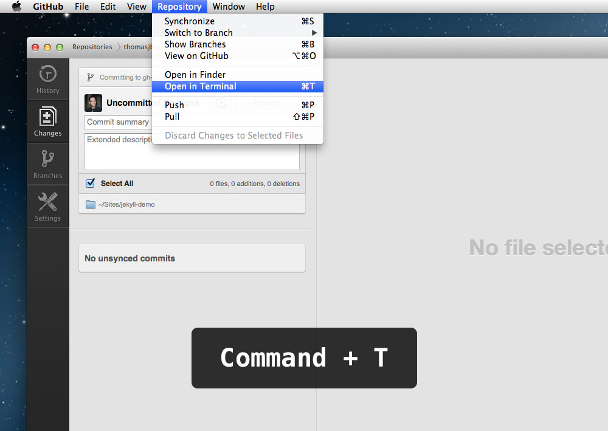
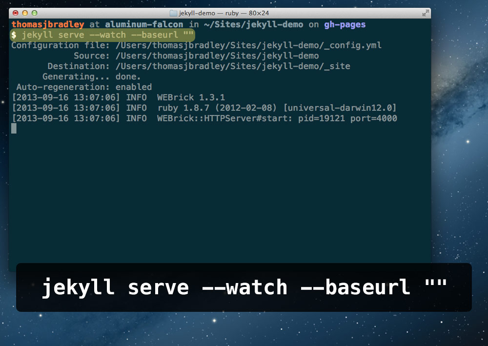

This cheat sheet assumes running Jekyll on GitHub Pages and that you’ve followed the setup directions here: <http://jekyllrb.com/docs/github-pages/>

---

## Open folder in Terminal

Click `Repository > Open in Terminal` in the GitHub application.



**Or** press `Command+T`.

---

## Run Jekyll

```bash
$ jekyll serve --watch --baseurl ""
```



Jekyll will now be available in your browser at the following URL: **<http://localhost:4000>**

---

## Stop Jekyll

```
Control+C
```


**Or** just quit Terminal.

---

## Video list

- [Jekyll: starting and stopping](https://www.youtube.com/watch?v=Vvh-PWMOf4g&list=PLWjCJDeWfDdfVEcLGAfdJn_HXyM4Y7_k-&index=4)
